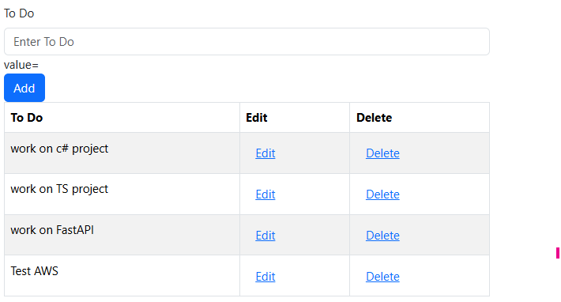

# React Hooks To-Do List

A simple To-Do List application built using React Hooks to demonstrate **C.R.U.D** (Create, Read, Update, Delete) functionality. The app uses `useReducer`, `useContext`, and custom hooks for state management and API interactions.

---

## Features

- Add new tasks to the to-do list.
- Delete tasks from the list.
- Fetch and display tasks from a mock API.
- State management using `useReducer` and `useContext`.

---

## Technologies Used

- **React**: Frontend framework.
- **React Hooks**: `useReducer`, `useContext`, `useState`, and `useEffect`.
- **Axios**: For API requests.
- **Bootstrap**: For styling and responsive design.
- **JSON Server**: Mock backend for testing API requests.

